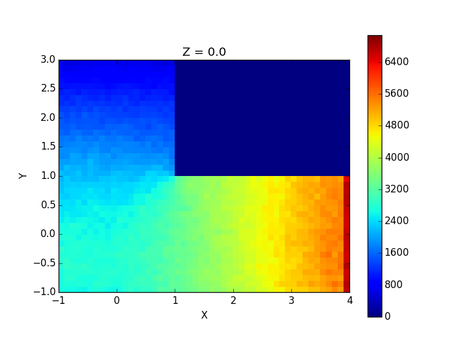

# molecularflow
Statistically simulates gas flow in the molecular flow regime (typically vacuum conditions). In such conditions the gas molecules don't interact with each other and thus can be simulated individually.

Currently, there's an analytical geometric model of a cylindrical elbow pipe. The gas molecules enter the pipe one by one at one end with random directions determined by Lambert's cosine law. The molecules are assumed to have equal velocities. After simulating several particles' passage through the pipe, transmission probability and a heat map are computed.

Here's a slice of a heat map produced by the program:

